<p align="center">
  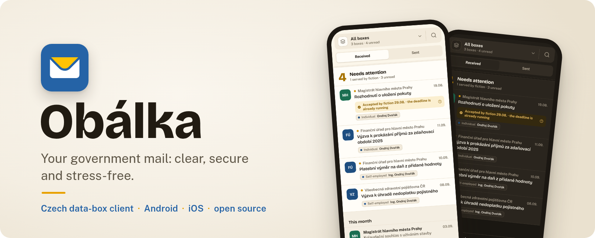
</p>

<p align="center">
  <a href="#what-it-looks-like"><strong>Screenshots</strong></a> &middot;
  <a href="#what-it-does"><strong>Features</strong></a> &middot;
  <a href="#privacy"><strong>Privacy</strong></a> &middot;
  <a href="#project-status"><strong>Status</strong></a> &middot;
  <a href="#installing-and-developing"><strong>Develop</strong></a> &middot;
  <a href="README.md"><strong>Česky</strong></a>
</p>

<p align="center">
  <a href="LICENSE"></a>
  <a href="#installing-and-developing"></a>
  <a href="package.json"></a>
  <a href="https://github.com/dorhawk-software/obalka/actions/workflows/ci.yml"></a>
  <a href="#project-status"></a>
  <a href="#built-with-ai"></a>
</p>

<br/>

<div align="center">
  <video src="https://github.com/user-attachments/assets/c687f704-126c-4475-ba93-651af7df279a" width="640" controls></video>
  <br/><sub>Obálka in 35 seconds. The video is in Czech.</sub>
</div>

<br/>

# Government mail that reads like mail.

A client for Czech data boxes (datové schránky) on Android and iOS. Open source, no server of ours, and an archive that does not vanish after ninety days.

**A Czech data box is a legal delivery address. It tends to be treated worse than a marketing email.**

|        | Step              | How                                                                                     |
| ------ | ----------------- | --------------------------------------------------------------------------------------- |
| **01** | Add your box      | Sign in with a password, an SMS code or the Mobile Key app.                             |
| **02** | Refresh           | Envelopes land in an encrypted archive on the phone; attachments on a tap, or by themselves. |
| **03** | Stay on top       | One inbox for every account, running deadlines, delivery records, and offline search.   |

<br/>

<div align="center">
<table>
  <tr>
    <td align="center"><strong>Sign-in</strong></td>
    <td align="center">🔑<br/><sub>Password</sub></td>
    <td align="center">💬<br/><sub>SMS code</sub></td>
    <td align="center">📱<br/><sub>Mobile Key</sub></td>
    <td align="center">🧪<br/><sub>Test environment</sub></td>
  </tr>
</table>

<em>Every sign-in method ISDS offers to third-party applications.</em>

</div>

<br/>

## Obálka is right for you if

- ✅ you have **more than one data box** (personal, sole trader, company) and do not want to watch three places
- ✅ you need your **attachments after 90 days**, when ISDS deletes them from its servers
- ✅ you want to know **when a deadline is running** and whether a message was already served by fiction
- ✅ you do not want an app **delivering your mail in the background** without you knowing
- ✅ you want a **backup nobody else can open**, and an easy **move to a new phone**
- ✅ you read your mail from the authorities mostly **on your phone**

<br/>

## What it looks like

<div align="center">

| Unified inbox | Delivery record | Box switcher |
|:---:|:---:|:---:|
| 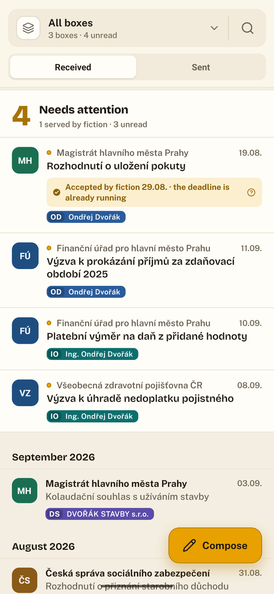 | 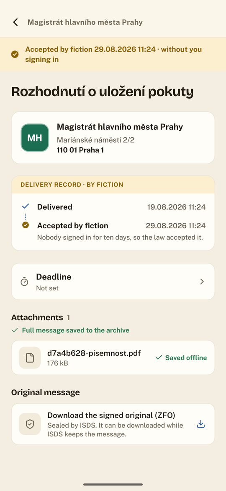 | 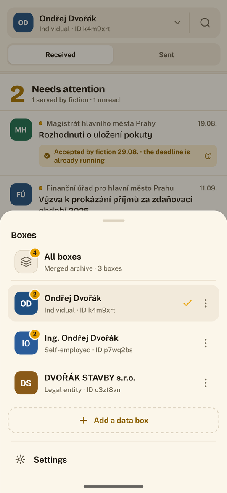 |
| Every box in one list. A chip on each message says which box it arrived in. | What happened, and when. A step appears only for something that actually happened. | Unread counts per box. "All" is visibly not just another box. |

| Search | A single box | Settings |
|:---:|:---:|:---:|
| 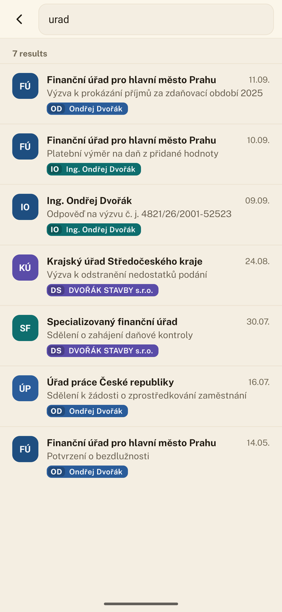 | 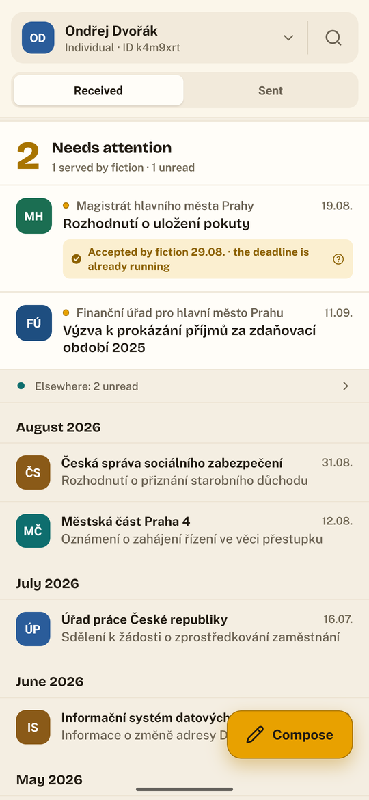 | 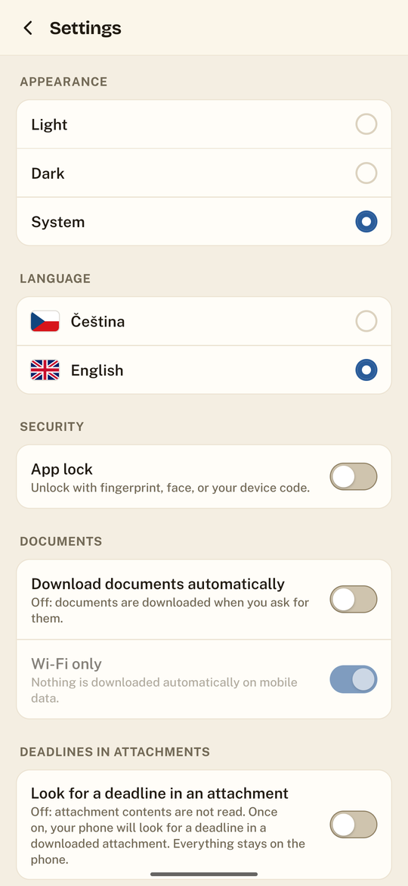 |
| Across every box, in the local archive, with no connection. | An "Elsewhere" line says something is waiting in another box without stealing attention. | Appearance, language, lock, documents, deadlines, diagnostics. |

| Documents by themselves | Backup with documents | A new phone |
|:---:|:---:|:---:|
| 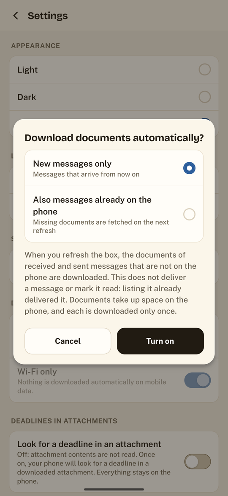 | 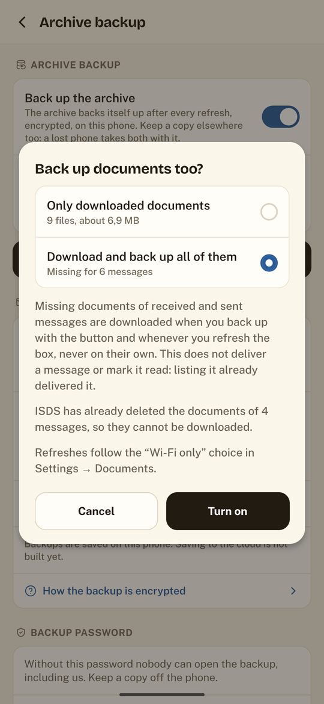 | 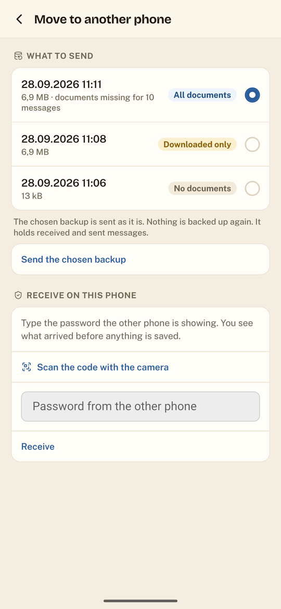 |
| New messages only, or the ones already on the phone too. The message stays unread. | Only downloaded documents, or all of them. What ISDS already deleted is said up front. | Pick a finished backup and send it. Each one says which documents it carries. |

<br/>

**Light and dark, independent of the phone's own setting.**

 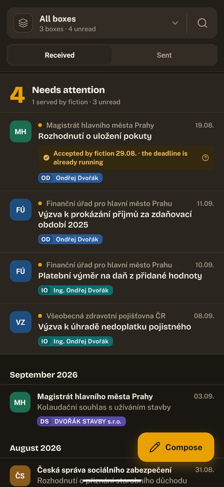

<sub>Every piece of data in these screenshots is invented (<code>src/dev/demoData.ts</code>). The
names, box IDs, case numbers and addresses are all fictional.</sub>

</div>

<br/>

## What it does

<table>
<tr>
<td align="center" width="33%">
<h3>🗄️ An archive that stays</h3>
Envelopes, attachments and each message's <strong>signed original</strong> (.zfo) stay in an encrypted database on the phone after ISDS deletes them.
</td>
<td align="center" width="33%">
<h3>📬 A unified inbox</h3>
One list across every account, the way email works. A chip on each message names the box it arrived in.
</td>
<td align="center" width="33%">
<h3>⏳ Deadlines and fiction</h3>
A <em>Needs attention</em> section shows the ten-day clock. Service by fiction is stated plainly, with the reason.
</td>
</tr>
<tr>
<td align="center">
<h3>🧾 Delivery record</h3>
A record, not a timeline. A step appears only for something that actually happened; opening a message is not one.
</td>
<td align="center">
<h3>✉️ Sending</h3>
Free to public authorities, and as a paid postal data message to private boxes, with the credit shown up front.
</td>
<td align="center">
<h3>🔎 Search</h3>
Across every box, over the local archive, offline.
</td>
</tr>
<tr>
<td align="center">
<h3>📥 Attachments by themselves</h3>
A refresh downloads the attachments of received and sent messages, Wi‑Fi only if you like. The message stays unread.
</td>
<td align="center">
<h3>💾 Encrypted backup</h3>
The whole archive, with every attachment if you choose. Without the password nobody opens it, including us.
</td>
<td align="center">
<h3>📲 A new phone</h3>
A backup you pick goes straight to the other phone with a one-time code or QR, its password with it.
</td>
</tr>
</table>

Optionally, and **only inside a file already downloaded to the phone**, Obálka can look for a
deadline in an attachment. Leave it off and attachment contents are never read at all.

<br/>

## What Obálka solves

| The problem | What Obálka does about it |
| --- | --- |
| ❌ ISDS keeps a message for 90 days after delivery and then deletes it. An attachment you did not download in time is gone for good. | ✅ Messages, attachments and signed originals stay in an encrypted archive on the phone for as long as you want. |
| ❌ After ten days a message is served by fiction (§ 17(4) of Act 300/2008 Coll.) whether you signed in or not. Deadlines run. | ✅ Running deadlines sit at the top in *Needs attention*, and service by fiction is stated plainly on the message. |
| ❌ A private person, a sole trader, a company: three boxes, three sign-ins, three places you must not forget to check. | ✅ One unified inbox, a chip on every message, and unread counts per account. |
| ❌ Merely listing your messages is legal service (§ 17(3)). An app that checks your box in the background delivers your mail without your knowledge. | ✅ Obálka signs in only when you tell it to. Nothing in the background, no silent delivery. |
| ❌ A new phone means starting with an empty archive. | ✅ An encrypted backup with attachments, and moving a finished backup to the new phone with one code. |

<br/>

## Privacy

This is a client for your mail from the state. It is built accordingly.

|                                   |                                                                                                                      |
| --------------------------------- | -------------------------------------------------------------------------------------------------------------------- |
| **No server.**                    | There is no backend for your mail or credentials to go to. The app talks to ISDS, and elsewhere only in two cases you decide on: crash reports (only with your consent), and moving the archive to another phone, which may go through croc's public relay, encrypted so the relay cannot read it. |
| **Nothing in the background.**    | The ISDS operating rules require an application on a local workstation to sign in only *"by a manual command of the user"*. Obálka does not sync in the background, at all. |
| **App lock.**                     | Optional: fingerprint, face or device passcode. When it is on, it locks the saved passwords and sign-ins too. The contents never appear in the app switcher. |
| **Encrypted backup.**             | A key only the user holds (Argon2id + XChaCha20-Poly1305, attachments with AES-256-GCM). Without it nobody opens the backup, including us. |
| **Crash reports ask first.**      | Sent: where the error happened and what it was. Never sent: message contents, subjects, names, box IDs, credentials, attachments or document text. EU servers, switchable off at any time. |
| **Debug mode uploads nothing.**   | It records a technical trace into a file on the phone; you share that file with whoever you choose. |

<div align="center">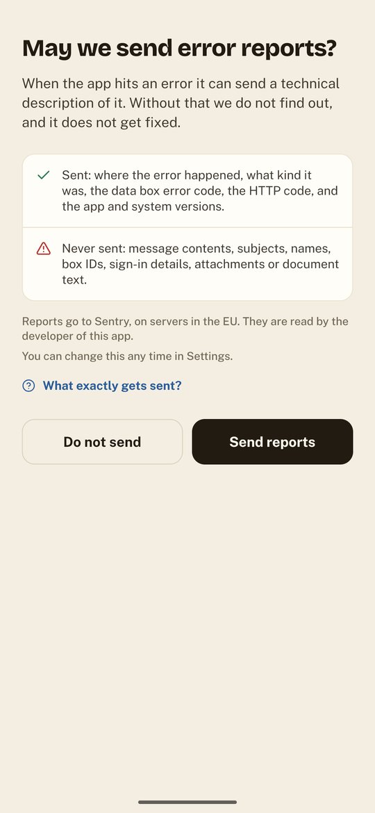</div>

**Found a security problem?** Please do not report it publicly — [`SECURITY.md`](SECURITY.md) says how.

<br/>

## What Obálka is not

|                                     |                                                                                                    |
| ----------------------------------- | -------------------------------------------------------------------------------------------------- |
| **Not an official app.**            | An independent client. Not from the Ministry of the Interior or the ISDS operator, and not affiliated with either. |
| **Not a cloud service.**            | No account, no server. The archive is on the phone; only a backup you move yourself goes anywhere. |
| **Not reading your mail for you.**  | Attachment contents are not read until you turn on the deadline scan, and even then only on the phone. |
| **Not legal advice.**               | Deadlines and service by fiction are shown as help. What counts is the law and the message itself. |

<br/>

## Built with

| | |
|---|---|
| **App** | React Native 0.86, New Architecture (Fabric + TurboModules), Hermes |
| **Language** | TypeScript, `strict` |
| **UI** | Tamagui, a custom "paper" design system, Reanimated, Gesture Handler |
| **Storage** | SQLCipher via op-sqlite (encrypted database), Keychain / Keystore for keys |
| **Crypto** | Argon2id, XChaCha20-Poly1305 and AES-256-GCM (backups) |
| **Transfer** | croc (Go via gomobile), Android and iOS |
| **ISDS** | SOAP over HTTPS, a hand-written client, per-box session isolation |
| **Languages** | Czech, English |

<br/>

## Installing and developing

```bash
npm ci
npm start                 # Metro

npm run android           # Android (JDK 17)
npm run ios               # iOS (macOS + Xcode)
```

For an emulator it is worth building a single architecture:

```bash
cd android && ./gradlew assembleDebug -PreactNativeArchitectures=x86_64
```

The checks CI runs, in one command (CI also runs a secret scan, `npm run audit:secrets`, which needs
Trivy installed):

```bash
npm run verify            # typecheck, lint, tests, attributions, dependency audit, palette
```

- **iOS tooling:** CocoaPods, installed through the `Gemfile`, needs Ruby 3.1 or later; the macOS system Ruby is too old.
- **Minimum iOS is 15.5** (forced by the former ML Kit QR reader; that is gone, the floor stayed); Android 7.0 (API 24).
- **QR reading without ML Kit:** iOS uses the system's `AVCaptureMetadataOutput` (through VisionCamera's core), Android uses zxing-cpp (`react-native-nitro-zxing`). Both run on the phone only and send nothing anywhere.
- **The phone-to-phone transfer** needs a Go library the normal build does not make: `scripts/build-transfer-aar.sh` (Android; Go, a JDK, the Android SDK and NDK) and `scripts/build-transfer-xcframework.sh` (iOS, macOS only; then run `pod install` again). Without it the app works and simply does not offer the transfer; CI and releases build it themselves (`docs/release-ci.md`).
- **iOS without a Mac:** `docs/sideload-ios-linux.md` (an unsigned IPA from GitHub Actions + iloader).
- **Test environment:** development runs against czebox, never against live boxes.

<br/>

## Quality

**Tests, a typecheck and a lint** run on every push and all have to pass. CI adds more checks: that
the licence attributions are current, that no vulnerable dependency reached the app, that no screen
hard-codes a colour outside the palette, that no credential was committed by accident, and that the
app still compiles for iOS.

Some of those tests guard decisions rather than behaviour: that diagnostics switched off never
transmit, that message contents cannot reach a crash report, that a row which opens something draws
the mark that says so, or that the app-switcher protection does not quietly revert to `FLAG_SECURE`,
which would take the user's own screenshots away.

<br/>

## Project status

**Before the first beta.**

- ✅ Accounts and sign-in (password, SMS code, Mobile Key), per-box session isolation
- ✅ Messages and attachments, the local archive and search
- ✅ Sending to authorities and private boxes, large messages included
- ✅ Deadlines, service by fiction and the delivery record
- ✅ The unified inbox and the box switcher
- ✅ Encrypted backup and restore, the backup password also as a QR code
- ✅ Phone-to-phone transfer on Android
- ✅ App lock, debug mode, light and dark themes, Czech and English
- 🟡 Signed originals of messages – done, not yet walked on a device
- 🟡 Phone-to-phone transfer on iPhone – done in code, not yet walked on an iPhone
- 🟡 Automatic attachment download and backups with every attachment – done, not yet walked against the test box
- ⚪ Beta on the App Store and Google Play
- ⚪ Backing up to the cloud (Google Drive, iCloud)

An honest per-feature breakdown, including what is **not** done, lives in
[`specs/README.md`](specs/README.md).

<br/>

## Built with AI

Obálka was written in large part by AI, specifically [Claude](https://claude.ai) by Anthropic. Stated
here plainly and without embarrassment: without that help the app would not exist, or it would have
taken years. We are grateful for it and see no reason to hide it.

What that means in practice:

- **A human decides what gets built and what ships.** The AI is a tool, not the author of the
  product. Every feature has a specification in [`specs/`](specs/), and anything unfinished is
  written down there as unfinished.
- **Nothing ships because it looks finished.** Tests, a typecheck, a lint and more checks in CI. The things that matter are also walked on a real device, because a class of bug no test
  sees: an invisible placeholder, text clipped at a larger font size, the inbox showing in the app
  switcher.
- **Decisions are written down, not just made.** The comments explain why, especially where the code
  looks needlessly complicated: why the delivery record is a record and not a timeline, why the app
  refuses to sync in the background at all, why the app-switcher protection must not reach for
  `FLAG_SECURE`.

A bug in the app belongs to the people who released it. That an AI helped is not an excuse, and is
not used as one here.

<br/>

## Support

Obálka is and will stay free and open source. If it saved you a headache and you'd like to say thanks,
you can [buy the developers a coffee](https://buymeacoffee.com/software.dorhawk). It doesn't unlock anything: it's a thank-you, not a subscription.

<br/>

## Licence

[MIT](LICENSE). Obálka is an independent data-box client. It is not an official application of the
Ministry of the Interior or of the ISDS operator, and is not affiliated with either.

<br/>

---

<p align="center">
  <sub>Open source under MIT. Built for people who get mail from the state that they cannot afford to miss.</sub>
</p>
