<p align="center">
  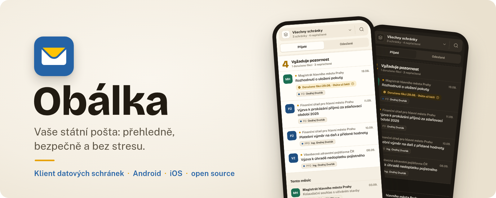
</p>

<p align="center">
  <a href="#jak-to-vypadá"><strong>Jak to vypadá</strong></a> &middot;
  <a href="#co-umí"><strong>Co umí</strong></a> &middot;
  <a href="#soukromí"><strong>Soukromí</strong></a> &middot;
  <a href="#stav-projektu"><strong>Stav</strong></a> &middot;
  <a href="#instalace-a-vývoj"><strong>Vývoj</strong></a> &middot;
  <a href="README.en.md"><strong>English</strong></a>
</p>

<p align="center">
  <a href="LICENSE"></a>
  <a href="#instalace-a-vývoj"></a>
  <a href="package.json"></a>
  <a href="https://github.com/dorhawk-software/obalka/actions/workflows/ci.yml"></a>
  <a href="#stav-projektu"></a>
  <a href="#postaveno-s-ai"></a>
</p>

<br/>

<div align="center">
  <video src="https://github.com/user-attachments/assets/c687f704-126c-4475-ba93-651af7df279a" width="640" controls></video>
</div>

<br/>

# Pošta od státu, která se čte jako pošta.

Klient datových schránek pro Android a iOS. Otevřený kód, žádný server a archiv, který nezmizí za devadesát dní.

**Datová schránka je ze zákona doručovací adresa. Zachází se s ní přitom hůř než s reklamním e‑mailem.**

|        | Krok                | Jak                                                                                  |
| ------ | ------------------- | ------------------------------------------------------------------------------------ |
| **01** | Přidejte schránku   | Přihlášení jménem a heslem, SMS kódem nebo Mobilním klíčem.                          |
| **02** | Aktualizujte        | Obálky zpráv se uloží do šifrovaného archivu v telefonu, přílohy na klepnutí nebo samy. |
| **03** | Mějte přehled       | Jedna schránka pro všechny účty, běžící lhůty, doručenky a hledání i bez připojení.  |

<br/>

<div align="center">
<table>
  <tr>
    <td align="center"><strong>Přihlášení</strong></td>
    <td align="center">🔑<br/><sub>Jméno a heslo</sub></td>
    <td align="center">💬<br/><sub>SMS kód</sub></td>
    <td align="center">📱<br/><sub>Mobilní klíč</sub></td>
    <td align="center">🧪<br/><sub>Testovací prostředí</sub></td>
  </tr>
</table>

<em>Všechny způsoby přihlášení, které ISDS aplikacím třetích stran nabízí.</em>

</div>

<br/>

## Obálka je pro vás, pokud

- ✅ máte **víc než jednu datovou schránku** (osobní, živnost, firma) a nechcete hlídat tři místa zvlášť
- ✅ potřebujete mít **přílohy i po 90 dnech**, kdy je ISDS ze svých serverů smaže
- ✅ chcete vědět, **kdy běží lhůta** a jestli už zpráva nebyla doručena fikcí
- ✅ nechcete, aby vám aplikace **doručovala poštu na pozadí** bez vašeho vědomí
- ✅ chcete **zálohu, kterou nikdo jiný neotevře**, a snadný **přechod na nový telefon**
- ✅ čtete poštu od úřadů hlavně **z telefonu**

<br/>

## Jak to vypadá

<div align="center">

| Sloučená schránka | Doručenka | Přepínač schránek |
|:---:|:---:|:---:|
| 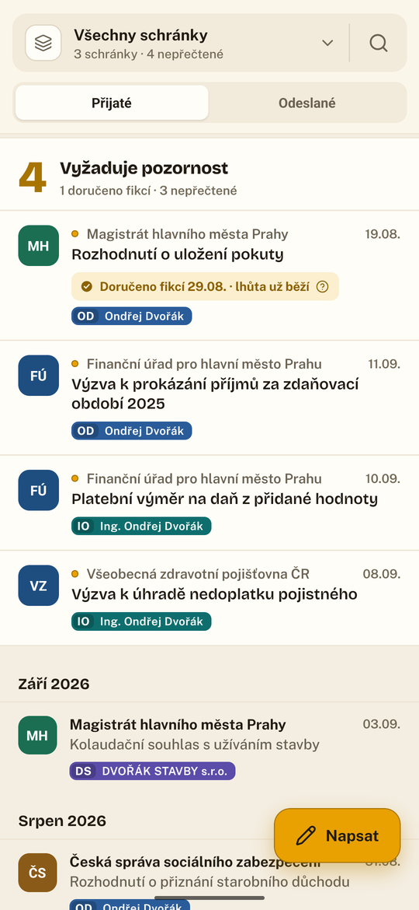 | 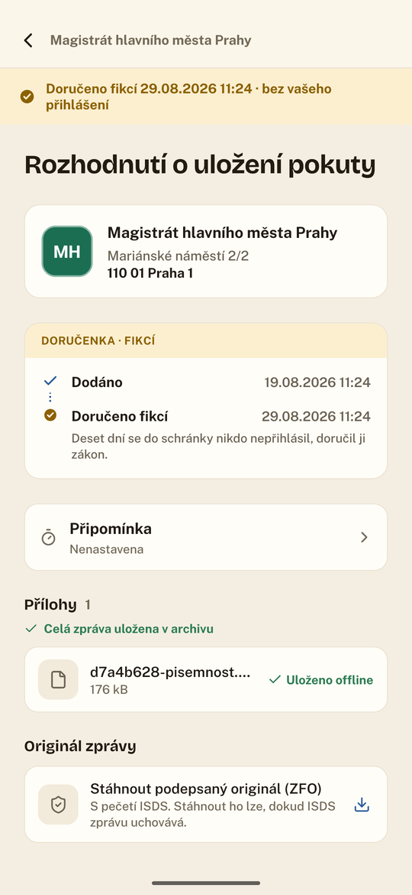 | 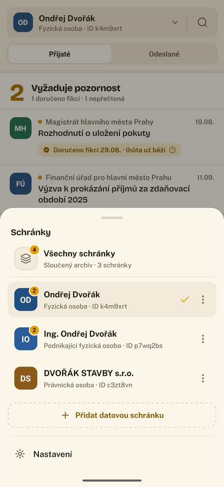 |
| Všechny schránky v jednom seznamu. Štítek u každé zprávy říká, kam přišla. | Co se stalo a kdy. Krok se zobrazí jen pro to, co se skutečně stalo. | Nepřečtené u každé schránky. „Vše“ je vidět, že je něco jiného než schránka. |

| Hledání | Jedna schránka | Nastavení |
|:---:|:---:|:---:|
| 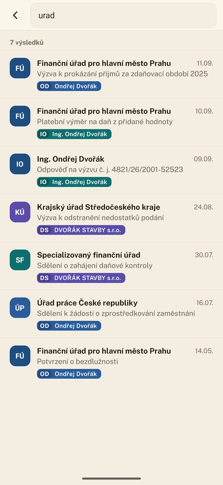 | 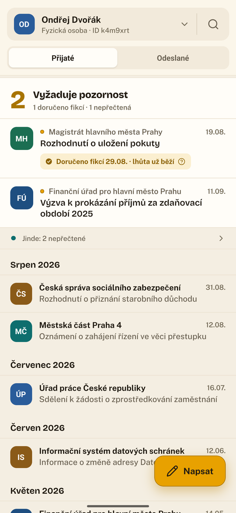 | 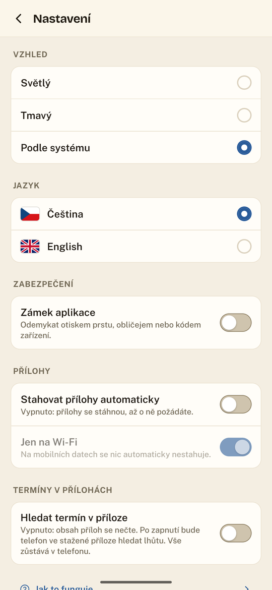 |
| Napříč všemi schránkami, v místním archivu, bez připojení. | Řádek „Jinde“ řekne, že něco leží i jinde, aniž by odvedl pozornost. | Vzhled, jazyk, zámek, přílohy, termíny, diagnostika. |

| Přílohy samy | Záloha s přílohami | Nový telefon |
|:---:|:---:|:---:|
| 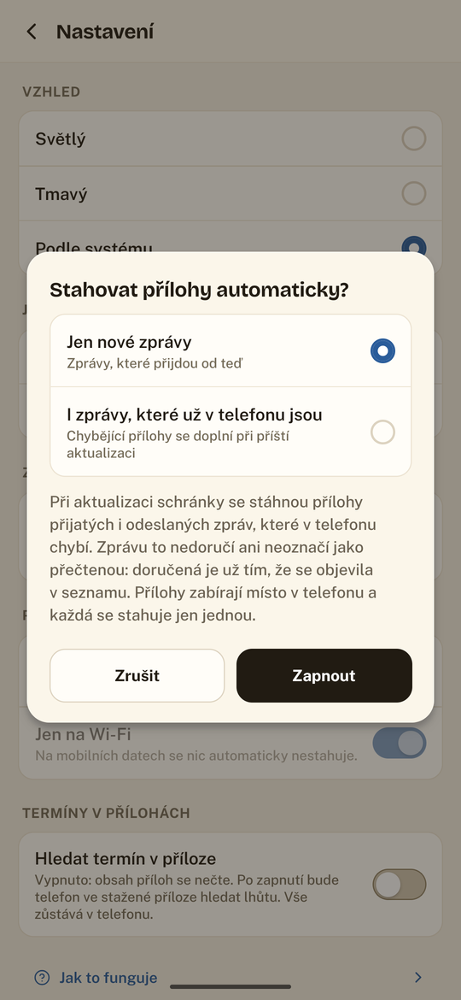 | 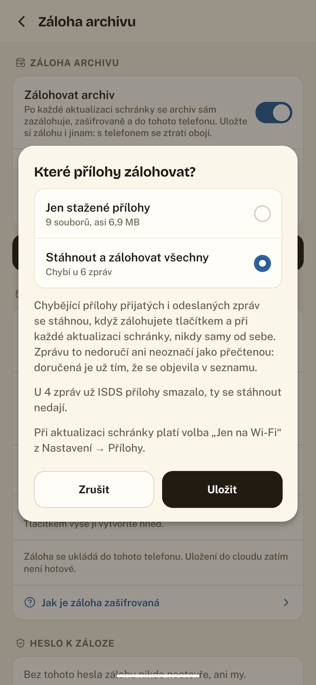 | 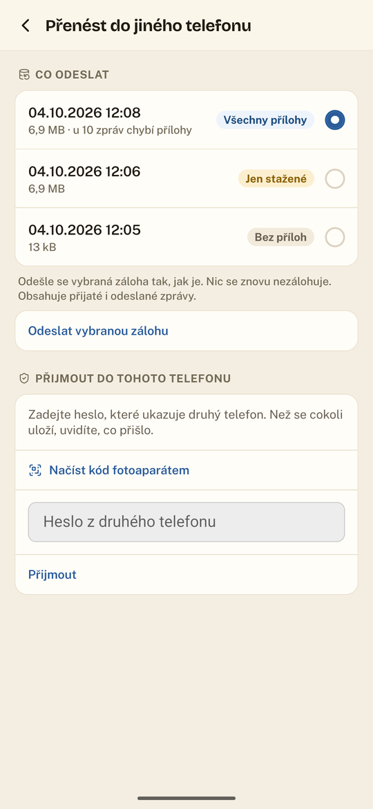 |
| Jen nové zprávy, nebo i ty, které už v telefonu jsou. Zpráva zůstane nepřečtená. | Jen stažené přílohy, nebo všechny. Co ISDS už smazalo, řekne předem. | Vyberete hotovou zálohu a pošlete ji. Každá říká, jaké přílohy nese. |

<br/>

**Světlý i tmavý motiv, nezávisle na nastavení telefonu.**

 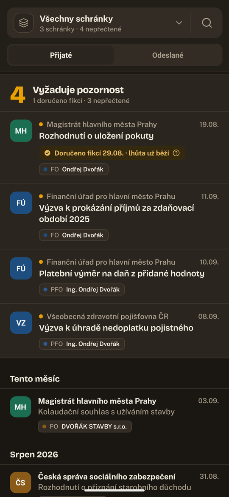

<sub>Všechna data na snímcích jsou vymyšlená (<code>src/dev/demoData.ts</code>). Jména, IDs schránek,
spisové značky i adresy jsou smyšlené.</sub>

</div>

<br/>

## Co umí

<table>
<tr>
<td align="center" width="33%">
<h3>🗄️ Archiv, který nemizí</h3>
Obálky, přílohy i <strong>podepsaný originál</strong> (.zfo) zůstávají v šifrované databázi v telefonu i poté, co je ISDS smaže.
</td>
<td align="center" width="33%">
<h3>📬 Sloučená schránka</h3>
Jeden seznam přes všechny účty, jako v e‑mailu. Štítek u každé zprávy řekne, kam přišla.
</td>
<td align="center" width="33%">
<h3>⏳ Termíny a fikce</h3>
Sekce <em>Vyžaduje pozornost</em> ukáže běžící desetidenní lhůtu. Doručení fikcí řekne rovnou a vysvětlí proč.
</td>
</tr>
<tr>
<td align="center">
<h3>🧾 Doručenka</h3>
Záznam, ne časová osa. Krok se zobrazí jen pro to, co se skutečně stalo; otevření zprávy krok není.
</td>
<td align="center">
<h3>✉️ Odesílání</h3>
Úřadům zdarma, soukromým schránkám jako poštovní datová zpráva s kreditem viditelným předem.
</td>
<td align="center">
<h3>🔎 Hledání</h3>
Napříč všemi schránkami, nad místním archivem, bez připojení.
</td>
</tr>
<tr>
<td align="center">
<h3>📥 Přílohy samy</h3>
Při aktualizaci schránky se stáhnou přílohy přijatých i odeslaných zpráv, volitelně jen na Wi‑Fi. Zpráva zůstane nepřečtená.
</td>
<td align="center">
<h3>💾 Šifrovaná záloha</h3>
Celý archiv, podle volby i se všemi přílohami. Bez hesla ji nikdo neotevře, ani my.
</td>
<td align="center">
<h3>📲 Nový telefon</h3>
Vybraná záloha přejde přímo do druhého telefonu přes jednorázový kód nebo QR, i s heslem k ní.
</td>
</tr>
</table>

Volitelně a **jen ve staženém souboru přímo v telefonu** umí Obálka hledat termín v příloze. Bez
zapnutí se obsah příloh vůbec nečte.

<br/>

## Co Obálka řeší

| Problém | Co s tím Obálka dělá |
| --- | --- |
| ❌ ISDS uchovává zprávu 90 dnů od doručení a pak ji smaže. Přílohu, kterou jste si nestáhli včas, už nedostanete. | ✅ Zprávy, přílohy i podepsané originály zůstávají v šifrovaném archivu v telefonu, jak dlouho chcete. |
| ❌ Po deseti dnech je zpráva doručena fikcí (§ 17 odst. 4 zákona 300/2008 Sb.), ať jste se přihlásili, nebo ne. Lhůty běží. | ✅ Běžící lhůty jsou nahoře v sekci *Vyžaduje pozornost* a doručení fikcí je u zprávy řečené rovnou. |
| ❌ Fyzická osoba, živnost, s.r.o.: tři schránky, tři přihlášení, tři místa, kam se nezapomenout podívat. | ✅ Jedna sloučená schránka se štítkem u každé zprávy a nepřečtené u každého účtu. |
| ❌ Samotné vypsání seznamu zpráv je právní doručení (§ 17 odst. 3). Aplikace, která kontroluje schránku na pozadí, doručuje poštu bez vašeho vědomí. | ✅ Obálka se přihlašuje jen na váš pokyn. Nic na pozadí, žádné tiché doručování. |
| ❌ Nový telefon znamená začít s prázdným archivem. | ✅ Šifrovaná záloha i s přílohami a přenos hotové zálohy do nového telefonu jedním kódem. |

<br/>

## Soukromí

Tohle je klient vaší pošty od státu. Podle toho je postavený.

|                                   |                                                                                                                      |
| --------------------------------- | -------------------------------------------------------------------------------------------------------------------- |
| **Žádný server.**                 | Neexistuje backend, kam by šla vaše pošta nebo přihlašovací údaje. Aplikace mluví s ISDS, a jinam jen ve dvou případech, o kterých rozhodujete vy: hlášení o chybách (jen se souhlasem) a přenos archivu do jiného telefonu, který může jít přes veřejný relay nástroje croc – zašifrovaně, relay obsah nepřečte. |
| **Nic na pozadí.**                | Provozní řád ISDS vyžaduje, aby se aplikace na místní stanici přihlašovala pouze *„pomocí manuálního příkazu uživatele“*. Obálka se nesynchronizuje na pozadí, vůbec. |
| **Zámek aplikace.**               | Volitelný: otisk, obličej nebo kód zařízení. Když je zapnutý, zamyká i uložená hesla a přihlášení ke schránkám. Obsah se nikdy neobjeví v přepínači aplikací. |
| **Šifrovaná záloha.**             | Heslo má jen uživatel (Argon2id + XChaCha20‑Poly1305, přílohy AES‑256‑GCM). Bez něj zálohu neotevře nikdo, ani my. |
| **Hlášení o chybách se ptají.**   | Odesílá se, kde chyba nastala a jaká byla. Nikdy obsah zpráv, předměty, jména, ID schránek, přihlašovací údaje, přílohy ani text dokumentů. Servery v EU, vypnutelné kdykoliv. |
| **Režim ladění nic neodesílá.**   | Zaznamená technický průběh do souboru v telefonu; ten sdílíte vy, komu chcete. |

<div align="center">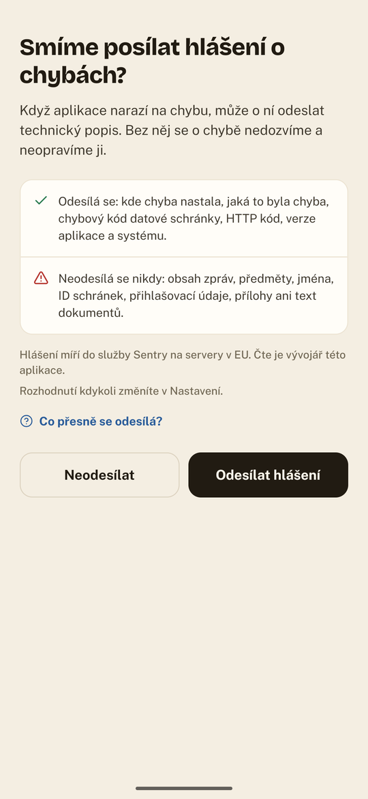</div>

**Našli jste bezpečnostní chybu?** Nehlaste ji veřejně – postup je v [`SECURITY.md`](SECURITY.md).

<br/>

## Co Obálka není

|                                     |                                                                                                   |
| ----------------------------------- | ------------------------------------------------------------------------------------------------- |
| **Není to oficiální aplikace.**     | Nezávislý klient. Není od Ministerstva vnitra ani od provozovatele ISDS a není s nimi nijak spojený. |
| **Není to cloudová služba.**        | Žádný účet, žádný server. Archiv je v telefonu a jinam jde jen záloha, kterou si sami přesunete.  |
| **Nečte vaši poštu za vás.**        | Obsah příloh se nečte, dokud nezapnete hledání termínů – a i potom jen v telefonu.                 |
| **Nenahrazuje právní radu.**        | Lhůty a doručení fikcí ukazuje jako pomoc. Rozhodující je, co říká zákon a samotná zpráva.        |

<br/>

## Technologie

| | |
|---|---|
| **Aplikace** | React Native 0.86, New Architecture (Fabric + TurboModules), Hermes |
| **Jazyk** | TypeScript, `strict` |
| **UI** | Tamagui, vlastní „paper“ design systém, Reanimated, Gesture Handler |
| **Úložiště** | SQLCipher přes op-sqlite (šifrovaná databáze), Keychain / Keystore na klíče |
| **Kryptografie** | Argon2id, XChaCha20‑Poly1305 a AES‑256‑GCM (zálohy) |
| **Přenos** | croc (Go přes gomobile), Android i iOS |
| **ISDS** | SOAP přes HTTPS, vlastní klient, izolace session po schránkách |
| **Jazyky** | Čeština, angličtina |

<br/>

## Instalace a vývoj

```bash
npm ci
npm start                 # Metro

npm run android           # Android (JDK 17)
npm run ios               # iOS (macOS + Xcode)
```

Pro emulátor se hodí sestavit jen jednu architekturu:

```bash
cd android && ./gradlew assembleDebug -PreactNativeArchitectures=x86_64
```

Testy a kontroly, které pouští i CI:

```bash
npm run verify            # typecheck, lint, testy, atribuce, audit závislostí, paleta
```

- **Nástroje pro iOS:** CocoaPods přes `Gemfile` potřebuje Ruby 3.1 nebo novější; systémové Ruby v macOS nestačí.
- **Minimální iOS je 15.5** (vynutila ho dřívější čtečka QR kódů postavená na ML Kit; ta už v aplikaci není, hranice zůstala); Android 7.0 (API 24).
- **Čtení QR kódů bez ML Kit:** iOS používá systémový `AVCaptureMetadataOutput` (přes jádro VisionCamera), Android zxing-cpp (`react-native-nitro-zxing`). Obojí běží jen v telefonu a nic nikam neposílá.
- **Přenos do jiného telefonu** potřebuje knihovnu v Go, kterou běžné sestavení nevyrábí: `scripts/build-transfer-aar.sh` (Android; Go, JDK, Android SDK a NDK) a `scripts/build-transfer-xcframework.sh` (iOS, jen na macOS; potom znovu `pod install`). Bez ní aplikace funguje, jen přenos nenabídne; CI a vydání ji sestavují samy (`docs/release-ci.md`).
- **iOS bez Macu:** `docs/sideload-ios-linux.md` (nepodepsaná IPA z GitHub Actions + iloader).
- **Testovací prostředí:** vývoj běží proti czebox, ne proti ostrým schránkám.

<br/>

## Kvalita

**Testy, typecheck a lint** běží na každý push a musí projít. CI k nim přidává další kontroly: že jsou
licenční atribuce aktuální, že se do aplikace nedostala zranitelná závislost, že v obrazovkách
nejsou natvrdo psané barvy mimo paletu, že v repozitáři neleží omylem uložený přístupový klíč a že se
aplikace přeloží i pro iOS.

Část testů nehlídá chování, ale rozhodnutí: že se vypnutá diagnostika nikdy neodešle, že se do
hlášení nedostane obsah zprávy, že řádek, který někam vede, kreslí šipku, nebo že se ochrana
přepínače aplikací nevrátí k `FLAG_SECURE`, které by uživateli vzalo snímky obrazovky.

<br/>

## Stav projektu

**Před první beta verzí.**

- ✅ Účty a přihlášení (jméno a heslo, SMS kód, Mobilní klíč), izolace session po schránkách
- ✅ Zprávy a přílohy, místní archiv a hledání
- ✅ Odesílání úřadům i soukromým schránkám, včetně velkých zpráv
- ✅ Termíny, fikce doručení a doručenka
- ✅ Sloučená schránka a přepínač schránek
- ✅ Šifrovaná záloha a obnova, heslo k záloze i jako QR kód
- ✅ Přenos do jiného telefonu na Androidu
- ✅ Zámek aplikace, režim ladění, světlý a tmavý motiv, čeština a angličtina
- 🟡 Podepsané originály zpráv – hotové, na zařízení zatím neprojité
- 🟡 Přenos do jiného telefonu na iPhonu – hotový v kódu, na iPhonu zatím neprojitý
- 🟡 Automatické stahování příloh a zálohy se všemi přílohami – hotové, proti testovací schránce zatím neprojité
- ⚪ Beta v App Store a Google Play
- ⚪ Zálohování do cloudu (Google Drive, iCloud)

Poctivý přehled po jednotlivých funkcích, včetně toho, co hotové **není**, je v
[`specs/README.md`](specs/README.md).

<br/>

## Postaveno s AI

Obálku z velké části napsala umělá inteligence, konkrétně [Claude](https://claude.ai) od Anthropicu.
Je to tu napsané rovnou a bez rozpaků: bez té pomoci by aplikace nevznikla, nebo by na ni padly roky.
Jsme za ni vděční a není důvod to skrývat.

Co to znamená v praxi:

- **Co se staví a co se pustí ven, rozhoduje člověk.** AI je nástroj, ne autor produktu. Každá funkce
  má svoji specifikaci v [`specs/`](specs/), a co není hotové, je tam napsané jako nehotové.
- **Nic nejde ven jen proto, že to vypadá hotově.** Testy, typecheck, lint a další kontroly v CI. Klíčové věci se navíc procházejí na skutečném zařízení, protože část chyb žádný test nevidí:
  neviditelný placeholder, oříznutý text při větším písmu, obsah schránky v přepínači aplikací.
- **Rozhodnutí jsou zapsaná, ne jen udělaná.** Komentáře v kódu vysvětlují proč, hlavně u věcí, které
  vypadají jako zbytečná komplikace: proč je doručenka záznam a ne časová osa, proč se aplikace
  zásadně nesynchronizuje na pozadí, proč ochrana přepínače aplikací nesmí sáhnout po `FLAG_SECURE`.

Chyba v aplikaci jde za lidmi, kteří ji vydali. To, že u toho pomáhala AI, není omluva a jako omluva
se tu nepoužívá.

<br/>

## Podpora

Obálka je a zůstane zdarma a s otevřeným kódem. Pokud vám ušetřila starosti a chcete poděkovat, můžete
vývojářům [koupit kafe](https://buymeacoffee.com/software.dorhawk). Nic se tím neodemyká – je to poděkování, ne předplatné.

<br/>

## Licence

[MIT](LICENSE). Obálka je nezávislý klient datových schránek. Není to oficiální aplikace
Ministerstva vnitra ani provozovatele ISDS a není s nimi nijak spojena.

<br/>

---

<p align="center">
  <sub>Otevřený kód pod licencí MIT. Postaveno pro lidi, kterým chodí od státu pošta, kterou nesmí přehlédnout.</sub>
</p>
